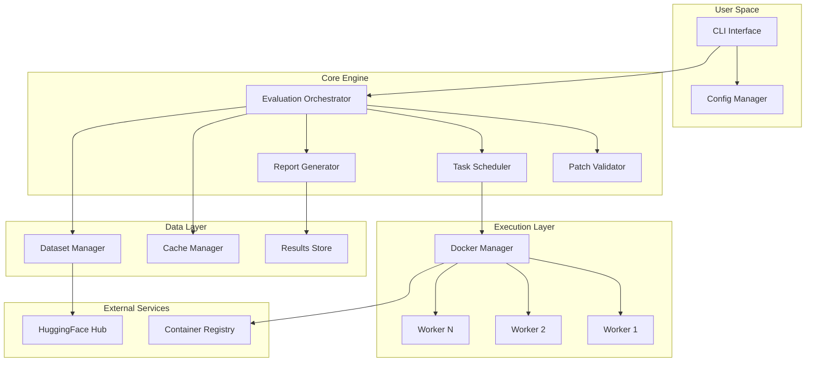
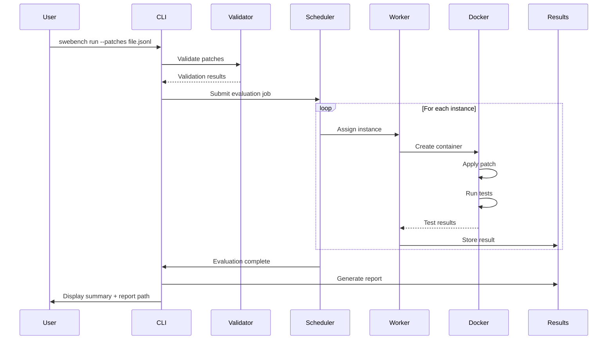
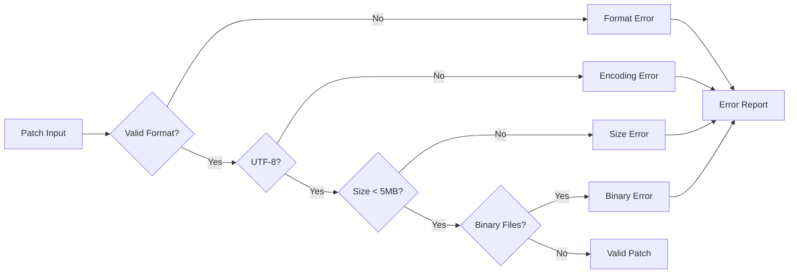
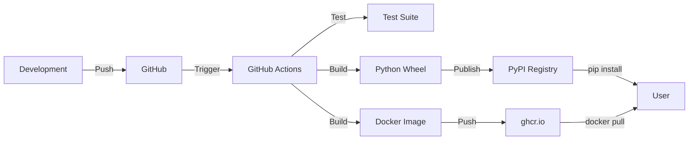

# SWE-Bench Runner Architecture Document

> Version 1.0 - Initial Architecture Design
> Based on PRD v1.0 and UX Plan v0.1

## 1. Executive Summary

SWE-Bench Runner is a CLI tool that simplifies running SWE-bench benchmarks. This architecture prioritizes:
- **Simplicity**: Single binary/wheel, minimal dependencies
- **Reliability**: Robust error handling, clear failure modes
- **Performance**: Parallel execution, efficient caching
- **Safety**: Sandboxed execution, non-root operation

## 2. Technology Stack

### 2.1 Core Implementation
- **Language**: Python 3.8+ (matches SWE-bench ecosystem)
- **CLI Framework**: Click 8.x (battle-tested, great UX primitives)
- **Container Runtime**: Docker SDK for Python (official, stable)
- **HTTP Client**: httpx (async support, retry logic built-in)
- **Progress Display**: Rich (beautiful terminal UI, progress bars)
- **Configuration**: Python dataclasses (simple, type-safe)
- **Streaming Parser**: ijson (memory-efficient JSONL parsing)

### 2.2 Packaging & Distribution
- **Package Format**: Python wheel via PyPI
- **Container Registry**: GitHub Container Registry (ghcr.io)
- **Base Image**: Ubuntu 22.04 (matches SWE-bench environment)

### 2.3 Development Tools
- **Type Checking**: mypy with strict mode
- **Linting**: ruff (fast, comprehensive)
- **Testing**: pytest + pytest-mock
- **CI/CD**: GitHub Actions

## 3. System Architecture

### 3.1 High-Level Components



### 3.2 Data Flow



### 3.3 Component Responsibilities

#### CLI Interface (`cli/`)
- Parse and validate command-line arguments
- Handle user interaction (prompts, progress display)
- Coordinate high-level workflow

#### Patch Validator (`validation/`)
- Parse JSONL/patch files
- Validate patch format (unified diff)
- Check size limits and encoding
- Pre-flight instance ID verification

#### Evaluation Orchestrator (`core/`)
- Manage evaluation lifecycle
- Coordinate between components
- Handle interruption/resume logic
- Aggregate results

#### Task Scheduler (`scheduler/`)
- Distribute work across parallel workers
- Monitor worker health
- Handle retries for flaky tests
- Enforce timeouts

#### Docker Manager (`execution/`)
- Pull/verify runner image
- Create and manage containers
- Mount volumes and set environment
- Stream logs from containers

#### Cache Manager (`cache/`)
- Manage dataset downloads
- Store Docker layers
- Clean up old artifacts
- Track disk usage

#### Report Generator (`reporting/`)
- Generate HTML reports
- Create JSON output
- Calculate statistics
- Format terminal summaries

## 4. Detailed Design

### 4.1 Container Architecture

```mermaid
graph LR
    subgraph "Host System"
        CLI[SWE-bench CLI]
        Cache[Cache Directory]
        Results[Results Directory]
    end
    
    subgraph "Runner Container"
        Entrypoint[entrypoint.sh]
        Conda[Conda Envs]
        Testbed[/testbed]
        Scripts[Evaluation Scripts]
    end
    
    CLI -->|docker run| Entrypoint
    Cache -->|mount :ro| Conda
    Results -->|mount :rw| Scripts
    Entrypoint -->|1. Clone repo| Testbed
    Entrypoint -->|2. Apply patch| Testbed
    Entrypoint -->|3. Run tests| Testbed
```

### 4.2 Monolithic Image Structure

```
ghcr.io/swebench/runner:v1.0.0-amd64
├── /opt/swebench/
│   ├── entrypoint.sh         # Main evaluation script
│   ├── scripts/
│   │   ├── clone_repo.py     # Git operations
│   │   ├── apply_patch.py    # Patch application
│   │   ├── run_tests.py      # Test execution
│   │   └── report_results.py # Result formatting
│   └── datasets/
│       ├── swe-bench-lite.json
│       ├── swe-bench-verified.json
│       └── swe-bench-full.json
├── /opt/conda/
│   └── envs/
│       ├── django/           # Pre-built environments
│       ├── flask/
│       ├── numpy/
│       └── ... (300+ environments)
└── /testbed/                 # Working directory
```

### 4.3 Patch Validation Pipeline



### 4.4 Worker Pool Architecture

```python
# Conceptual worker pool design
class WorkerPool:
    def __init__(self, max_workers: int):
        self.max_workers = min(max_workers, cpu_count())
        self.queue = asyncio.Queue()
        self.workers = []
        self.results = {}
    
    async def evaluate_instances(self, instances: List[Instance]):
        # Fill queue
        for instance in instances:
            await self.queue.put(instance)
        
        # Start workers
        for i in range(self.max_workers):
            worker = asyncio.create_task(self._worker(i))
            self.workers.append(worker)
        
        # Wait for completion
        await self.queue.join()
        
    async def _worker(self, worker_id: int):
        while True:
            instance = await self.queue.get()
            result = await self._evaluate_instance(instance)
            self.results[instance.id] = result
            self.queue.task_done()
```

## 5. File Structure (Simplified)

```
swe-bench-runner/
├── pyproject.toml              # Project metadata and dependencies
├── README.md                   # User documentation
├── LICENSE                     # MIT license
├── .github/
│   ├── workflows/
│   │   ├── ci.yml            # Test and lint
│   │   ├── release.yml       # Build and publish
│   │   └── docker.yml        # Build runner image
│   └── ISSUE_TEMPLATE/       # Bug reports, features
├── src/
│   └── swebench_runner/
│       ├── __init__.py       # Version and exports
│       ├── __main__.py       # Entry point
│       ├── cli.py            # All CLI logic and commands
│       ├── runner.py         # Core evaluation engine
│       ├── docker_api.py     # Docker operations
│       ├── validation.py     # Patch validation
│       ├── report.py         # HTML/JSON generation
│       ├── models.py         # Dataclasses for patches/results
│       ├── version.py        # Version compatibility
│       ├── errors.py         # Custom exceptions
│       ├── constants.py      # Configuration defaults
│       └── templates/        # HTML report templates
│           └── report.html
├── tests/
│   ├── conftest.py          # Shared fixtures
│   ├── test_cli.py          # CLI tests
│   ├── test_runner.py       # Core logic tests
│   ├── test_validation.py   # Validation tests
│   ├── test_docker.py       # Docker mock tests
│   └── fixtures/
│       ├── mini_dataset.json # 5 test instances
│       ├── patches/          # Test patches
│       └── mock_repos/       # Minimal test repos
├── docker/
│   ├── Dockerfile.full      # Full 14GB image
│   ├── Dockerfile.lite      # Lite 2GB image
│   ├── scripts/
│   │   ├── entrypoint.sh
│   │   ├── evaluate.py      # Instance evaluation
│   │   └── build_envs.py    # Pre-build conda envs
│   └── requirements/         # Per-repo dependencies
└── docs/
    ├── troubleshooting.md
    ├── development.md
    └── architecture.md      # This document
```

## 6. Key Design Decisions

### 6.1 Monolithic Docker Image
**Decision**: Single 14GB image with all conda environments pre-built
**Rationale**: 
- Eliminates runtime environment setup (30+ min → 0)
- Predictable performance
- Simple distribution model
- Trade disk space for user experience

### 6.2 Python Implementation
**Decision**: Pure Python implementation
**Rationale**:
- Matches SWE-bench ecosystem
- Excellent Docker SDK
- Rich ecosystem for CLI tools
- Easy contribution for researchers

### 6.3 Local-First Architecture
**Decision**: No backend services, all computation local
**Rationale**:
- Zero infrastructure to maintain
- Complete user control
- No API keys (except optional HuggingFace)
- Predictable costs

### 6.4 Hybrid Concurrency Model
**Decision**: asyncio for I/O operations, thread pool for Docker
**Rationale**:
- Docker SDK is blocking but we can manage connections better
- asyncio handles network I/O efficiently
- ThreadPoolExecutor for Docker operations
- Better resource utilization

### 6.5 Progressive Download Strategy
**Decision**: Offer both lite (2GB) and full (14GB) images
**Rationale**:
- Lower barrier to entry for new users
- Faster initial experience
- Full image available when needed
- Auto-detection based on dataset

### 6.6 Version Management
**Decision**: Explicit compatibility matrix with runtime checks
**Rationale**:
- SWE-bench evolves regularly
- Prevent silent failures
- Clear upgrade path
- Support multiple versions

## 7. Security Considerations

### 7.1 Container Isolation
- Each evaluation runs in isolated container
- No network access from evaluation containers
- Read-only mount for cache data
- Minimal container capabilities

### 7.2 Resource Limits
```yaml
container_config:
  mem_limit: "8g"
  cpus: 1.0
  pids_limit: 1000
  readonly_rootfs: false  # Tests may write temp files
  security_opt:
    - "no-new-privileges"
```

### 7.3 Input Validation
- Patch size limits enforced
- No arbitrary code execution
- Validated patch format only
- Safe path handling

## 8. Performance Optimization

### 8.1 Parallel Execution
- Default workers = CPU cores
- Dynamic worker adjustment based on Docker limits
- Smart work distribution (heavy repos first)

### 8.2 Caching Strategy
- Docker layer caching
- Dataset caching with checksums
- Resume capability for interrupted runs

### 8.3 Resource Management
- Automatic container cleanup
- Memory limit monitoring
- Disk space checks
- Graceful degradation

## 9. Version Management & Compatibility

### 9.1 Version Compatibility Matrix
```python
# version.py
COMPATIBILITY_MATRIX = {
    "1.0.0": {
        "datasets": ["v1.0", "v1.1"],
        "min_docker": "20.10.0",
        "image_tag": "v1.0.0"
    },
    "1.1.0": {
        "datasets": ["v1.0", "v1.1", "v1.2"],
        "min_docker": "20.10.0",
        "image_tag": "v1.1.0"
    }
}

def check_compatibility(dataset_version: str) -> bool:
    """Verify dataset compatibility with current CLI"""
    cli_version = __version__
    compat = COMPATIBILITY_MATRIX.get(cli_version, {})
    return dataset_version in compat.get("datasets", [])
```

### 9.2 Update Detection
```python
# Auto-update checking
async def check_updates() -> UpdateInfo:
    """Check for CLI and image updates"""
    cli_update = await check_pypi_version()
    image_update = await check_ghcr_tags()
    return UpdateInfo(
        cli_latest=cli_update,
        image_latest=image_update,
        breaking_changes=parse_changelog()
    )
```

### 9.3 Smart Defaults Detection
```python
def detect_patches_file() -> Optional[Path]:
    """Auto-detect patches file in current directory"""
    candidates = [
        "predictions.jsonl",
        "patches.jsonl",
        "model_patches.jsonl"
    ]
    for name in candidates:
        path = Path(name)
        if path.exists() and path.stat().st_size > 0:
            return path
    return None

def detect_dataset_type(patches: List[Patch]) -> str:
    """Infer dataset type from instance IDs"""
    instance_ids = [p.instance_id for p in patches]
    if all(id in LITE_INSTANCES for id in instance_ids):
        return "lite"
    elif all(id in VERIFIED_INSTANCES for id in instance_ids):
        return "verified"
    return "full"
```

## 10. Deployment Architecture

### 10.1 Distribution


### 10.2 Version Strategy
- CLI version locked to image version
- Automatic compatibility checking
- Clear upgrade path
- Backward compatibility for patches

## 11. Monitoring & Telemetry

### 11.1 Local Metrics
- Evaluation duration per instance
- Success/failure rates
- Resource usage statistics
- Cache hit rates

### 11.2 Error Reporting
- Structured error codes
- Detailed error messages
- Debug bundle generation
- No automatic telemetry (privacy-first)

## 12. Testing Strategy

### 12.1 Test Pyramid
- **Unit Tests**: Component logic, validation (70%)
- **Integration Tests**: Docker operations, file I/O (20%)
- **End-to-End Tests**: Full evaluation flow (10%)
- **Performance Tests**: Resource usage, timing

### 12.2 Test Infrastructure
```python
# conftest.py - Comprehensive test fixtures
@pytest.fixture
def mock_docker():
    """Mock Docker client with predictable behavior"""
    client = Mock(spec=docker.DockerClient)
    container = Mock()
    container.logs.return_value = b"Tests passed"
    container.wait.return_value = {"StatusCode": 0}
    container.attrs = {"State": {"ExitCode": 0}}
    client.containers.run.return_value = container
    return client

@pytest.fixture
def mini_dataset():
    """Minimal test dataset with 5 instances"""
    return [
        Instance("django__django-11001", "django", "Fix..."),
        Instance("flask__flask-2001", "flask", "Add..."),
        Instance("numpy__numpy-13001", "numpy", "Fix..."),
        Instance("pandas__pandas-20001", "pandas", "Fix..."),
        Instance("scipy__scipy-10001", "scipy", "Add...")
    ]

@pytest.fixture
def flaky_container():
    """Container that fails first time, passes second"""
    container = Mock()
    container.wait.side_effect = [
        {"StatusCode": 1},  # First attempt fails
        {"StatusCode": 0}   # Retry succeeds
    ]
    return container
```

### 12.3 Test Scenarios
```python
# Key test scenarios
class TestCriticalPaths:
    def test_auto_detect_patches_file(self, tmp_path):
        """Test smart defaults detection"""
        (tmp_path / "predictions.jsonl").write_text('{}')
        detected = detect_patches_file()
        assert detected.name == "predictions.jsonl"
    
    def test_resume_interrupted_run(self, mock_state):
        """Test checkpoint/resume functionality"""
        runner = Runner.from_checkpoint(mock_state)
        assert runner.completed_instances == 50
        assert runner.next_instance == 51
    
    def test_docker_limit_detection(self, mock_docker):
        """Test auto-adjustment of worker count"""
        mock_docker.info.return_value = {"Containers": 95}
        workers = calculate_max_workers(requested=10)
        assert workers == 5  # Reduced to stay under limit
    
    def test_flaky_test_retry(self, flaky_container):
        """Test retry logic for flaky tests"""
        result = evaluate_with_retry(flaky_container, retries=2)
        assert result.status == "passed"
        assert result.flaky is True
```

## 13. Development Workflow

### 13.1 Local Development
```bash
# Setup
git clone https://github.com/swebench/runner
cd runner
pip install -e ".[dev]"

# Run tests
pytest
mypy src/
ruff check src/

# Test CLI
python -m swebench_runner run --patches tests/fixtures/mini.jsonl
```

### 13.2 Release Process
1. Update version in `pyproject.toml`
2. Create git tag `v1.0.0`
3. Push tag → triggers CI/CD
4. CI builds wheel + Docker image
5. Publishes to PyPI + ghcr.io

## 14. Risk Mitigation Strategies

### 14.1 Docker Daemon Protection
```python
# Auto-detect and adjust worker count
def calculate_max_workers(requested: int) -> int:
    """Adjust workers based on Docker limits"""
    docker_info = docker_client.info()
    current_containers = docker_info.get("Containers", 0)
    max_containers = docker_info.get("ContainersLimit", 100)
    
    # Leave headroom for system
    available = max(1, max_containers - current_containers - 10)
    actual = min(requested, available)
    
    if actual < requested:
        click.echo(f"⚠️ Reduced workers to {actual} due to Docker limits")
    
    return actual
```

### 14.2 Network Resilience
```python
# Retry decorator for network operations
@retry(
    stop=stop_after_attempt(5),
    wait=wait_exponential(multiplier=1, min=4, max=60),
    before_sleep=log_retry_attempt
)
async def download_dataset(url: str, token: Optional[str]) -> Path:
    """Download with automatic retry and backoff"""
    headers = {"Authorization": f"Bearer {token}"} if token else {}
    async with httpx.AsyncClient() as client:
        response = await client.get(url, headers=headers)
        response.raise_for_status()
        return save_dataset(response.content)
```

### 14.3 Resource Monitoring
```python
# Pre-flight resource checks
def check_resources() -> ResourceStatus:
    """Verify sufficient resources before starting"""
    disk_free = shutil.disk_usage(".").free
    docker_storage = get_docker_storage_free()
    memory_available = psutil.virtual_memory().available
    
    issues = []
    if disk_free < 50 * 1024**3:  # 50GB
        issues.append(f"Low disk space: {disk_free / 1024**3:.1f}GB")
    
    if docker_storage < 30 * 1024**3:  # 30GB
        issues.append(f"Low Docker storage: {docker_storage / 1024**3:.1f}GB")
    
    if memory_available < 8 * 1024**3:  # 8GB
        issues.append(f"Low memory: {memory_available / 1024**3:.1f}GB")
    
    return ResourceStatus(ok=len(issues) == 0, issues=issues)
```

### 14.4 Checkpoint & Resume
```python
# Robust checkpoint system
class CheckpointManager:
    def __init__(self, run_dir: Path):
        self.checkpoint_file = run_dir / ".checkpoint.json"
        self.lock_file = run_dir / ".lock"
    
    def save(self, state: RunState) -> None:
        """Atomic checkpoint save"""
        temp_file = self.checkpoint_file.with_suffix(".tmp")
        with open(temp_file, "w") as f:
            json.dump(asdict(state), f, indent=2)
        
        # Atomic rename
        temp_file.replace(self.checkpoint_file)
    
    def load(self) -> Optional[RunState]:
        """Load checkpoint if valid"""
        if not self.checkpoint_file.exists():
            return None
        
        try:
            with open(self.checkpoint_file) as f:
                data = json.load(f)
            return RunState(**data)
        except (json.JSONDecodeError, TypeError):
            click.echo("⚠️ Corrupted checkpoint, starting fresh")
            return None
```

## 15. Performance Optimizations

### 15.1 Streaming JSONL Parser
```python
# Memory-efficient patch loading
async def stream_patches(file_path: Path) -> AsyncIterator[Patch]:
    """Stream patches without loading entire file"""
    async with aiofiles.open(file_path, 'r') as f:
        async for line in f:
            if line.strip():
                data = json.loads(line)
                yield Patch(**data)
```

### 15.2 Smart Work Distribution
```python
# Optimize instance ordering
def optimize_instance_order(instances: List[Instance]) -> List[Instance]:
    """Order instances for optimal throughput"""
    # Group by repository
    by_repo = defaultdict(list)
    for inst in instances:
        by_repo[inst.repo].append(inst)
    
    # Interleave repositories to maximize cache reuse
    result = []
    iterators = [iter(items) for items in by_repo.values()]
    
    while iterators:
        for it in list(iterators):
            try:
                result.append(next(it))
            except StopIteration:
                iterators.remove(it)
    
    return result
```

---

*This simplified architecture prioritizes developer velocity and user delight while maintaining robustness. All complexity is intentionally deferred to V2.*