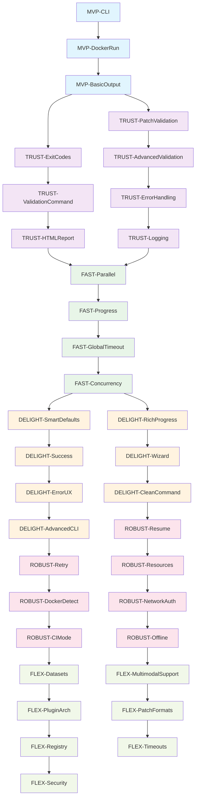

# SWE-Bench Runner Implementation Plan

> High-level roadmap for building the world's simplest SWE-bench evaluation tool

## Overview

This implementation plan breaks down our 6 value-driven phases into specific, actionable work plans. Each work plan represents a focused, testable unit of work that delivers clear user value.

## Phase Breakdown

### Phase 1: Minimum Viable Magic
*Value: User can actually run SWE-bench*

- [ ] **MVP-CLI** - Basic CLI structure with Click
- [ ] **MVP-DockerRun** - Execute single instance in Docker
- [ ] **MVP-BasicOutput** - Print results to terminal

**Dependencies**: None (starting point)
**Success Criteria**: `swebench run --patches file.jsonl` executes one instance and shows pass/fail

### Phase 2: Make It Trustworthy
*Value: User trusts the results and can debug failures*

- [ ] **TRUST-PatchValidation** - Basic patch format validation
- [ ] **TRUST-ExitCodes** - Proper exit code handling
- [ ] **TRUST-AdvancedValidation** - Comprehensive patch validation with size/encoding checks
- [ ] **TRUST-ValidationCommand** - `swebench validate` command
- [ ] **TRUST-ErrorHandling** - Clear error messages with solutions
- [ ] **TRUST-HTMLReport** - Basic HTML report generation
- [ ] **TRUST-Logging** - Save logs for debugging

**Dependencies**: MVP-* (needs working CLI and Docker execution)
**Success Criteria**: Users can validate patches and debug failures with proper error handling

### Phase 3: Make It Fast
*Value: User can iterate quickly on their patches*

- [ ] **FAST-Parallel** - Thread pool implementation
- [ ] **FAST-Progress** - Progress tracking and display
- [ ] **FAST-GlobalTimeout** - Global timeout support for entire runs
- [ ] **FAST-Concurrency** - Docker daemon limit detection and worker adjustment

**Dependencies**: TRUST-* (needs reliable single-instance execution)
**Success Criteria**: Lite dataset (300 instances) completes in <10 minutes with proper resource management

### Phase 4: Make It Delightful
*Value: User thinks "Holy shit, this is what I wanted!"*

- [ ] **DELIGHT-SmartDefaults** - Auto-detect patches file
- [ ] **DELIGHT-RichProgress** - Beautiful progress UI with Rich
- [ ] **DELIGHT-Success** - Celebration screens and encouraging messages
- [ ] **DELIGHT-Wizard** - First-run setup wizard
- [ ] **DELIGHT-ErrorUX** - Helpful error messages with clear solutions
- [ ] **DELIGHT-CleanCommand** - `swebench clean` cache management
- [ ] **DELIGHT-AdvancedCLI** - Glob patterns, random sampling, count limits

**Dependencies**: FAST-* (needs parallel execution working)
**Success Criteria**: First-time users succeed without reading docs, power users have advanced selection

### Phase 5: Make It Robust
*Value: User can rely on it for real work*

- [ ] **ROBUST-Resume** - Checkpoint and resume interrupted runs
- [ ] **ROBUST-Retry** - Flaky test handling with retry logic
- [ ] **ROBUST-Resources** - Pre-flight resource checks
- [ ] **ROBUST-DockerDetect** - Docker Desktop detection and setup help
- [ ] **ROBUST-NetworkAuth** - HuggingFace authentication and proxy support
- [ ] **ROBUST-CIMode** - `--no-input` and `--json` flags for CI environments
- [ ] **ROBUST-Offline** - Offline mode support

**Dependencies**: DELIGHT-* (needs polished user experience)
**Success Criteria**: Users can run in CI, handle network issues, and run overnight reliably

### Phase 6: Make It Flexible
*Value: Power users can customize to their needs*

- [ ] **FLEX-Datasets** - Multiple dataset support (lite/verified/full/multimodal)
- [ ] **FLEX-MultimodalSupport** - Base64 image handling for multimodal dataset
- [ ] **FLEX-PluginArch** - Plugin architecture for additional benchmarks
- [ ] **FLEX-PatchFormats** - Support for `--patches-dir` and multiple input formats
- [ ] **FLEX-Registry** - Alternative registry support with `--registry` flag
- [ ] **FLEX-Timeouts** - Custom timeout controls per instance and globally
- [ ] **FLEX-Security** - Advanced security options and patch size limits

**Dependencies**: ROBUST-* (needs reliable foundation)
**Success Criteria**: Researchers can run exactly what they need with any input format or benchmark

## Implementation Roadmap

## Work Plan Details

Each work plan will be created as a separate file in `Documentation/Plans/` with this structure:

- **Task ID**: Unique identifier
- **Problem Statement**: What we're solving
- **Proposed Solution**: How we'll solve it
- **Test Plan**: How we'll validate it works
- **Implementation Checklist**: Step-by-step tasks
- **Dependencies**: What must be done first
- **Success Criteria**: Definition of done

## Progress Tracking

### Completed Work Plans: 0/35 (0%)

**Phase 1: Minimum Viable Magic (0/3)**
- [ ] MVP-CLI
- [ ] MVP-DockerRun  
- [ ] MVP-BasicOutput

**Phase 2: Make It Trustworthy (0/7)**
- [ ] TRUST-PatchValidation
- [ ] TRUST-ExitCodes
- [ ] TRUST-AdvancedValidation
- [ ] TRUST-ValidationCommand
- [ ] TRUST-ErrorHandling
- [ ] TRUST-HTMLReport
- [ ] TRUST-Logging

**Phase 3: Make It Fast (0/4)**
- [ ] FAST-Parallel
- [ ] FAST-Progress
- [ ] FAST-GlobalTimeout
- [ ] FAST-Concurrency

**Phase 4: Make It Delightful (0/7)**
- [ ] DELIGHT-SmartDefaults
- [ ] DELIGHT-RichProgress
- [ ] DELIGHT-Success
- [ ] DELIGHT-Wizard
- [ ] DELIGHT-ErrorUX
- [ ] DELIGHT-CleanCommand
- [ ] DELIGHT-AdvancedCLI

**Phase 5: Make It Robust (0/7)**
- [ ] ROBUST-Resume
- [ ] ROBUST-Retry
- [ ] ROBUST-Resources
- [ ] ROBUST-DockerDetect
- [ ] ROBUST-NetworkAuth
- [ ] ROBUST-CIMode
- [ ] ROBUST-Offline

**Phase 6: Make It Flexible (0/7)**
- [ ] FLEX-Datasets
- [ ] FLEX-MultimodalSupport
- [ ] FLEX-PluginArch
- [ ] FLEX-PatchFormats
- [ ] FLEX-Registry
- [ ] FLEX-Timeouts
- [ ] FLEX-Security

## Key Principles

1. **Each phase must work completely** before moving to the next
2. **Serial execution must work** before adding parallelism
3. **Basic errors must work** before helpful errors
4. **Every work plan delivers user value** when completed
5. **Dependencies are strictly enforced** - no skipping ahead

## Critical PRD Requirements Coverage

**New Additions Based on PRD Review:**

### Multimodal Support (PRD 5.10)
- **FLEX-MultimodalSupport**: Handle base64 image encoding/decoding (deferred to Phase 6)
- **FLEX-Datasets**: Support multimodal dataset variant

### Comprehensive Validation (PRD 5.10)
- **TRUST-PatchValidation**: Basic format validation (moved from Phase 1)
- **TRUST-AdvancedValidation**: Size, encoding, binary file detection
- **TRUST-ValidationCommand**: `swebench validate` pre-flight command

### Plugin Architecture (PRD 5.8)
- **FLEX-PluginArch**: `plugins/swebench.py` module for extensibility (deferred to Phase 6)

### Advanced CLI Features (PRD 5.3, 5.10)
- **DELIGHT-AdvancedCLI**: `--count N --sample random-seed`, glob patterns
- **FLEX-PatchFormats**: `--patches-dir` support

### Network & Authentication (PRD 5.12, 5.13)
- **ROBUST-NetworkAuth**: HuggingFace tokens, proxy support, retry logic

### CI/Headless Support (PRD 5.9)
- **TRUST-ExitCodes**: Structured exit codes (1=harness, 2=docker, 3=network, 4=disk) (moved from Phase 1)
- **ROBUST-CIMode**: `--no-input` and `--json` flags

### Cache Management (PRD 5.11)
- **DELIGHT-CleanCommand**: `swebench clean` with `--dry-run`

### Global Timeout (PRD 5.4)
- **FAST-GlobalTimeout**: `--global-timeout-hours` support

### Security & Flexibility (PRD 5.10, 6)
- **FLEX-Security**: Patch size limits, security options
- **FLEX-Registry**: `--registry` flag for alternative container registries

## Next Steps

Phase 1 work plans have been created in `Documentation/Plans/core-plans/`:
- ✓ **01-MVP-CLI** - Basic CLI structure
- ✓ **02-MVP-DockerRun** - Docker execution
- ✓ **03-MVP-BasicOutput** - Terminal output

Next actions:
1. Implement and test **01-MVP-CLI**
2. Once complete, implement **02-MVP-DockerRun**
3. Finally, implement **03-MVP-BasicOutput**
4. Then create Phase 2 work plans in numbered order

This implementation plan now covers all PRD requirements and will be updated as work plans are completed and checked off.